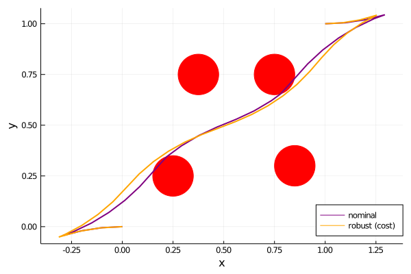
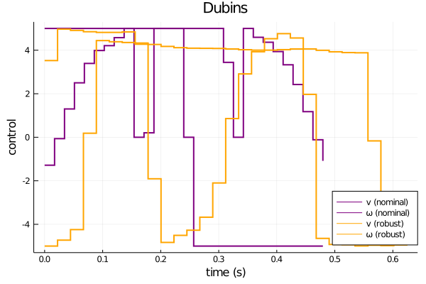

## DIRTREL.jl

This repository provides an implementation of [DIRTREL: Robust Trajectory Optimization with Ellipsoidal Disturbances and LQR Feedback](https://rexlab.stanford.edu/papers/dirtrel-auro.pdf), written in Julia.

DIRTREL finds locally optimal solutions to the robust trajectory optimization problem:
```
minimize        l(X,U) + lw(X,U)
  X,U,H
subject to      f(x+,x,u,h) = 0
                h+ = h
                x1 = x(0)
                xT = x(tf)
                ul <= u <= uu
                xl <= x <= xu
                c(x,u) >= 0
                ul <= uw <= uu
                xl <= xw <= xu
                c(xw,uw) >= 0
                hl <= h <= hu.            
```

## Installation
```code
git clone https://github.com/thowell/DIRTREL.jl
```

## Examples
The [pendulum](https://github.com/thowell/DIRTREL.jl/blob/master/examples/pendulum_robust.jl) and [cartpole](https://github.com/thowell/DIRTREL.jl/blob/master/examples/cartpole_robust.jl) examples from the paper are reproduced*.

### Pendulum


### Cartpole


### Dubins



## TODO
- [X] add linear robust state bounds
- [X] add stage robust constraints
- [ ] replace ForwardDiff with analytical derivatives
- [ ] compare results with SNOPT
