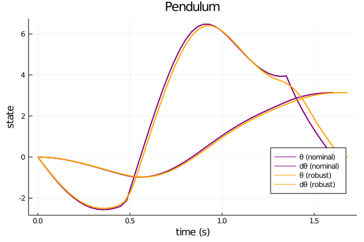
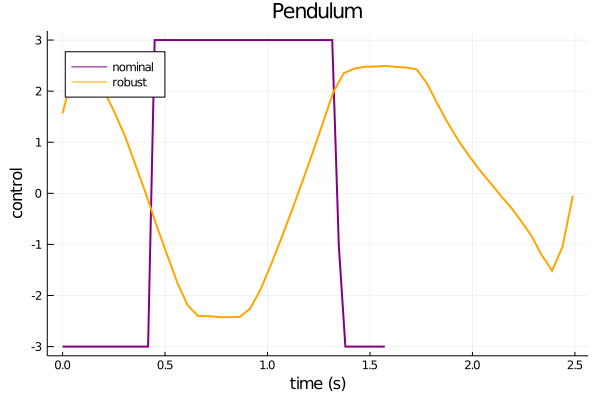
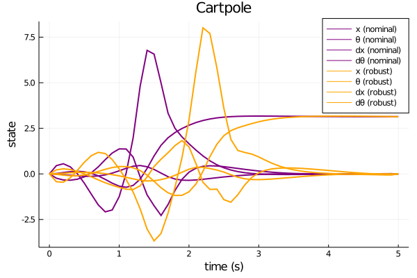
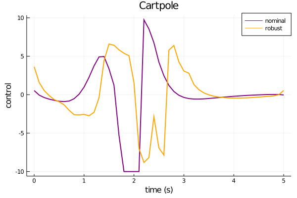

## DIRTREL.jl

This repository provides a basic implementation of [DIRTREL: Robust Trajectory Optimization with Ellipsoidal Disturbances and LQR Feedback](https://rexlab.stanford.edu/papers/dirtrel-auro.pdf) written in Julia.

DIRTREL finds locally optimal solutions to the robust trajectory optimization problem:
```
minimize        l(X,U) + lw(X,U)
  X,U,H
subject to      f(x+,x,u,h) = 0
                h+ = h
                x1 = x(0)
                xT = x(tf)
                ul <= u <= uu
                xl <= x <= xu
                ul <= uw <= uu
                xl <= xw <= xu
                hl <= h <= hu.            
```
The state,
```
X = [x1,...,xT],
```
control,
```
U = [u1,...,uT-1],
```
and timestep,
```
H = [h1,...,hT-1],
```
trajectories are optimized by minimizing a quadratic tracking cost function,
```
l(X,U) = (x-xT)'QT(x-xT) + h Σ {(x-xt)'Qt(x-xt) + (u-ut)'Rt(u-ut) + c},
```
and the robust cost function (Eq. 29). For simplicity of the implementation,
robust constraints are only implemented for state and control bounds (not general
constraints).

## Installation
```code
git clone https://github.com/thowell/DIRTREL.jl
```

## Examples
The [pendulum](https://github.com/thowell/DIRTREL.jl/blob/master/examples/pendulum_robust.jl) and [cartpole](https://github.com/thowell/DIRTREL.jl/blob/master/examples/cartpole_robust.jl) examples from the paper are reproduced*.

### Pendulum



### Cartpole



*Note: Because the open-source non-convex solver [Ipopt](https://github.com/coin-or/Ipopt)
is used in place of [SNOPT](https://web.stanford.edu/group/SOL/snopt.htm),
the optimized trajectories differ slightly, but the qualitative behavior is similar.

## TODO
- [X] add linear robust state bounds
- [ ] add general robust constraints
- [ ] replace ForwardDiff with analytical derivatives
- [ ] compare results with SNOPT
