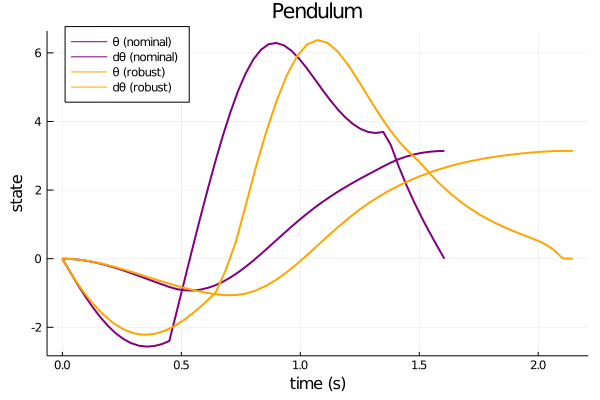
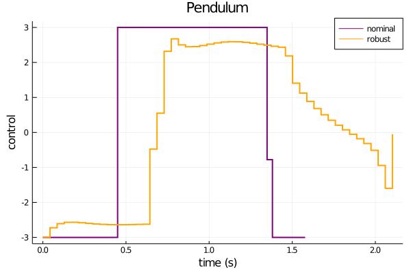

## DIRTREL.jl

This repository provides a basic implementation of [DIRTREL: Robust Trajectory Optimization with Ellipsoidal Disturbances and LQR Feedback](https://agile.seas.harvard.edu/files/agile/files/dirtrel.pdf) written in Julia.

The following robust trajectory optimization problem is solved,
```
minimize        l(X,U) + lw(X,U)
  X,U,H
subject to      x+ = f(x,u,h)
                h+ = h
                x1 = x(0)
                xT = x(tf)
                ul <= u <= uu
                xl <= x <= xu
                ul <= uw <= uu
                xl <= xw <= xu
                hl <= h <= hu,             
```
where for simplicity, all constraints (apart from dynamics) are linear bounds
and the object is,
```
l(X,U) = (x-xT)'QT(x-xT) + h Σ {(x-xt)'Qt(x-xt) + (u-ut)'Rt(u-ut) + c},
```
a quadratic tracking cost function.

## Installation
```code
git clone https://github.com/thowell/DIRTREL.jl
```

## Examples
The [pendulum](https://github.com/thowell/DIRTREL.jl/blob/master/examples/pendulum_robust.jl) and [cartpole](https://github.com/thowell/DIRTREL.jl/blob/master/examples/cartpole_robust.jl) examples from the paper are reproduced* using [Ipopt](https://github.com/coin-or/Ipopt)





## TODO
- [ ] linear state bounds
- [ ] general constraints
- [ ] analytical derivatives
- [ ] SNOPT
